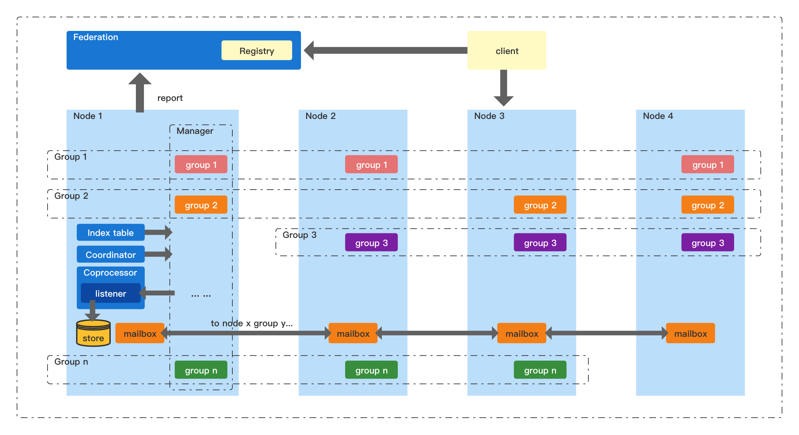
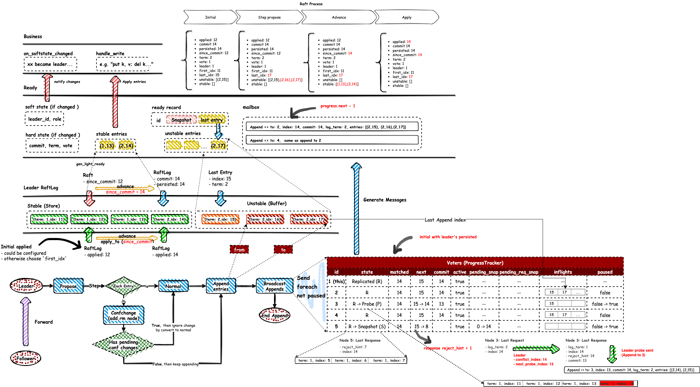

## Overview

**yu-the-great** was designed to support both single raft group and multi raft scenarios, it's guarantee the proposal entries append and applied in order and in strong consistency, but how to apply and how to design the propose data, it's user's business, "yu" only notify these events to "listener" which implement by user.

## Architecture

### Physical

#### Single Group

When developing the application in single raft mode, all deployed Node 

#### Multi Groups

### Logical

#### Single

## Consensus Algorithm
### Process

#### Propose & Append

Both leader and follower can accept `propose`, only leader can handle it, when a follower receive propose, it'll forwarding this propose to it's leader which it heard from. Once a leader received a propose with some entries (without `term` and `index`), it will set increment index (since RaftLog's `last_index`) and `current term` to these entries, then generate some `MsgAppend` messages to send after persist entries.

## Components

### Network

### Storage

## Coprocessor

